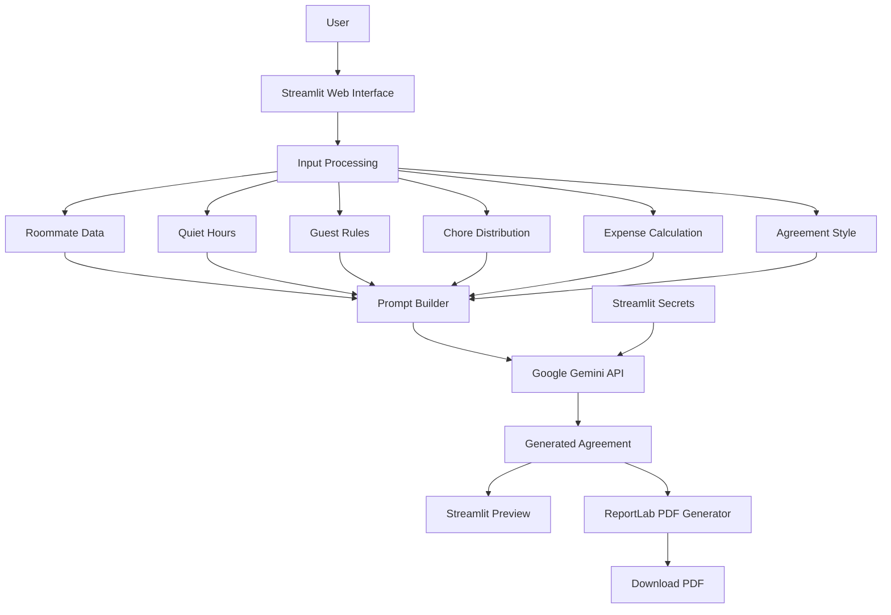

# Roommate Agreement Generator — System Design

## 1. System Overview

The Roommate Agreement Generator is a Streamlit-based AI application that collects shared-living preferences from roommates and uses Google Gemini to generate a customized roommate agreement.

The system provides:

```text
User Input
    ↓
Input Processing
    ↓
Business Logic
    ↓
Gemini API
    ↓
Generated Agreement
    ↓
PDF Generation
    ↓
Download
```

---

# 2. System Architecture



---

# 3. Component Architecture

## 3.1 Presentation Layer

Technology:

```text
Streamlit
```

Responsibilities:

* Display application interface
* Collect user inputs
* Display agreement
* Provide PDF download
* Display loading and success messages

---

## 3.2 Business Logic Layer

Technology:

```text
Python
```

Responsibilities:

* Calculate equal expense shares
* Assign chores
* Organize roommate information
* Construct Gemini prompt
* Process generated agreement

Example:

```python
rent_each = rent / num_roommates
wifi_each = wifi / num_roommates
electricity_each = electricity / num_roommates
```

---

## 3.3 AI Layer

Technology:

```text
Google Gemini API
google-genai SDK
```

Responsibilities:

* Understand structured roommate preferences
* Generate natural-language agreement
* Apply selected writing style
* Include required agreement sections

The application sends a structured prompt to Gemini.

---

## 3.4 Document Layer

Technology:

```text
ReportLab
```

Responsibilities:

* Create A4 PDF
* Add title
* Add generated agreement content
* Return PDF as an in-memory file
* Provide download functionality

---

# 4. Data Flow

### Step 1 — User Input

The user enters:

```text
Number of roommates
Roommate names
Quiet hours
Weekday/weekend rules
Guest permissions
Overnight guest permissions
Maximum guests
Advance notice
Chore assignments
Rent
Wi-Fi
Electricity
Agreement style
```

---

### Step 2 — Local Processing

The Python application processes the input.

Expense calculation:

```text
Rent per roommate
    = Total Rent / Number of Roommates

Wi-Fi per roommate
    = Total Wi-Fi / Number of Roommates

Electricity per roommate
    = Total Electricity / Number of Roommates
```

Chores are distributed using a simple round-robin approach.

Example:

```text
Roommates = 3

Cleaning       → Roommate 1
Kitchen        → Roommate 2
Bathroom       → Roommate 3
Garbage        → Roommate 1
Floor cleaning → Roommate 2
Dusting        → Roommate 3
```

---

### Step 3 — Prompt Construction

The processed information is inserted into a structured Gemini prompt.

The prompt contains:

```text
Roommate information
Quiet-hour information
Guest rules
Chore assignments
Shared expenses
Agreement style
Required agreement sections
AI disclaimer
```

---

### Step 4 — Gemini API Request

The application sends the prompt to Gemini.

```python
response = client.models.generate_content(
    model="gemini-3.7-flash",
    contents=prompt
)
```

Gemini returns the generated agreement as text.

---

### Step 5 — Agreement Preview

The generated text is displayed inside Streamlit.

```python
st.markdown(agreement)
```

The user can review the generated agreement before downloading it.

---

### Step 6 — PDF Generation

The agreement is passed to ReportLab.

```text
Generated Text
      ↓
ReportLab
      ↓
A4 PDF
      ↓
BytesIO
      ↓
Streamlit Download Button
```

The PDF is generated in memory, so a permanent server-side file is not required.

---

# 5. API Integration Strategy

## Gemini API

The application uses the Google GenAI Python SDK.

```python
from google import genai
```

The API client is initialized using a secret API key:

```python
client = genai.Client(
    api_key=st.secrets["GEMINI_API_KEY"]
)
```

The API key is stored in:

```text
.streamlit/secrets.toml
```

Example:

```toml
GEMINI_API_KEY = "YOUR_API_KEY"
```

The secrets file is excluded from Git using `.gitignore`.

---

## API Request

The application sends one generation request after the user submits the form.

```text
Streamlit
    ↓
Prompt Builder
    ↓
Gemini API
    ↓
Generated Agreement
```

---

## API Response

The generated content is extracted from the response:

```python
agreement = response.text
```

The result is then used by two components:

```text
                    ┌──► Streamlit Preview
Gemini Response ────┤
                    └──► ReportLab PDF
```

---

# 6. Logic Modules

## Module 1 — Roommate Management

Input:

```text
Number of roommates
Roommate names
```

Output:

```text
List of roommate names
```

---

## Module 2 — Quiet Hours

Input:

```text
Start time
End time
Weekdays
Weekends
```

Output:

```text
Quiet-hour rules
```

---

## Module 3 — Guest Rules

Input:

```text
Guests allowed
Overnight guests
Maximum guests
Advance notice
```

Output:

```text
Guest policy
```

---

## Module 4 — Chore Distribution

The system automatically assigns chores using:

```python
if j % num_roommates == i:
```

This creates a basic equal distribution.

---

## Module 5 — Expense Calculation

The system calculates equal financial contributions.

```python
rent_each = rent / num_roommates
wifi_each = wifi / num_roommates
electricity_each = electricity / num_roommates
```

---

## Module 6 — Prompt Generation

All processed information is combined into a single structured prompt.

This gives Gemini enough context to generate a customized agreement.

---

## Module 7 — Agreement Generation

Gemini generates sections including:

```text
1. Roommates
2. Quiet Hours
3. Guest Rules
4. Chores
5. Shared Expenses
6. Cleanliness
7. Conflict Resolution
8. Agreement Changes
```

---

## Module 8 — PDF Generation

ReportLab converts the generated text into an A4 PDF.

The PDF is stored in memory using:

```python
BytesIO()
```

This allows the user to download the document without creating a permanent file on the server.

---

# 7. Security Design

The application uses environment-level secrets rather than hard-coding API credentials.

### Correct

```python
st.secrets["GEMINI_API_KEY"]
```

### Avoid

```python
client = genai.Client(
    api_key="actual-api-key"
)
```

The following files must not be committed:

```text
.env
.streamlit/secrets.toml
secrets.toml
```

They are excluded using `.gitignore`.

---

# 8. Error Handling Considerations

The production version should handle:

```text
Missing API key
Invalid Gemini API request
Gemini API failure
Empty Gemini response
Invalid user input
PDF generation failure
```

A recommended implementation would wrap the Gemini request:

```python
try:
    response = client.models.generate_content(
        model="gemini-3.7-flash",
        contents=prompt
    )

    agreement = response.text

except Exception as e:
    st.error("Unable to generate the agreement. Please try again.")
```

This prevents raw API errors from breaking the entire Streamlit application.

---

# 9. Deployment Architecture

The application can be deployed using Streamlit Community Cloud.

```text
                 GitHub Repository
                        │
                        ▼
                Streamlit Cloud
                        │
                        ├── app.py
                        ├── requirements.txt
                        └── Streamlit Secrets
                               │
                               ▼
                         Gemini API
                               │
                               ▼
                      Generated Agreement
```

The API key should be configured through the deployment platform's secrets configuration rather than committed to GitHub.

---

# 10. Repository Structure

```text
roommate-agreement-generator/
│
├── app.py
├── requirements.txt
├── README.md
├── .gitignore
│
├── .streamlit/
│   └── secrets.toml
│
└── docs/
    └── system-design.md
```

---

# 11. Future Improvements

Potential improvements include:

```text
[ ] Custom chore selection
[ ] Different chore schedules
[ ] Unequal expense splitting
[ ] Multiple PDF formatting templates
[ ] Agreement version history
[ ] User authentication
[ ] Database storage
[ ] Email agreement sharing
[ ] Digital signatures
[ ] Multi-language support
[ ] Better PDF styling
```

---

# 12. Limitations

The current system does not permanently store agreements or user accounts.

The AI-generated agreement should also not be treated as professional legal advice.

The current chore assignment uses a simple equal-distribution algorithm and does not account for individual roommate preferences.

---

# 13. Conclusion

The Roommate Agreement Generator combines a simple Streamlit interface with Python business logic, Google Gemini AI, and ReportLab PDF generation.

The system demonstrates:

```text
Frontend Development
        +
Python Programming
        +
Generative AI
        +
API Integration
        +
Document Generation
        +
Cloud Deployment
```

This makes the project suitable as a practical demonstration of an AI-powered application with a complete user-to-output workflow.
